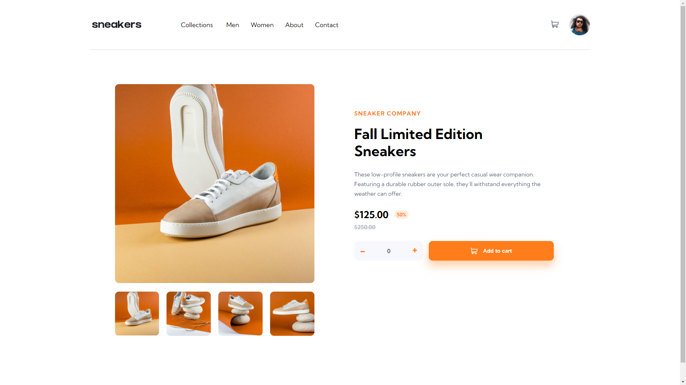

# Frontend Mentor - E-commerce product page solution

This is a solution to the [E-commerce product page challenge on Frontend Mentor](https://www.frontendmentor.io/challenges/ecommerce-product-page-UPsZ9MJp6). 

## Table of contents

- [Overview](#overview)
  - [The challenge](#the-challenge)
  - [Screenshot](#screenshot)
  - [Links](#links)
- [My process](#my-process)
  - [Built with](#built-with)
  - [What I learned](#what-i-learned)
  - [Continued development](#continued-development)
  - [Useful resources](#useful-resources)

## Overview

### The challenge

Your task is to build out the project to the designs inside the `/design` folder. You will find both a mobile and a desktop version of the design.

The designs are in JPG static format. Using JPGs will mean that you'll need to use your best judgment for styles such as `font-size`, `padding` and `margin`.

Users should be able to:

- View the optimal layout for the site depending on their device's screen size
- See hover states for all interactive elements on the page
- Open a lightbox gallery by clicking on the large product image
- Switch the large product image by clicking on the small thumbnail images
- Add items to the cart
- View the cart and remove items from it

### Screenshot

I've included 4 screenshots in the `/screenshots` folder: mobile, tablet, desktop, and fullscreen.

### Links

I'll update these links once I've submitted my solution. 

- [Solution URL](https://your-solution-url.com)
- [Live Site URL](https://your-live-site-url.com)

## My process

I started with the HTML while observing the desktop design then wrote the CSS for the mobile version
and expanded from there. 

I normally do all the layout stuff then implement things like the hover states. The functionality and
JavaScript came last. 

### Built with

- Semantic HTML5 markup
- CSS custom properties
- Flexbox
- Mobile-first workflow
- Vanilla JS

### What I learned

Where do I even begin? 

I definitely felt how this challenge is a step up from the others I've done so far.
There's a lot of things I had to implement, so it took much longer, as expected. 

I learned how to implement a responsive navbar along with a hamburger menu. I also learned about the 
`text-overflow` property; something I initially intended to use but chose to go in a different direction.

It's purpose would've been to make the text form an ellipsis when there isn't enough room to show the entire
sentence. 

I learned about slideshows and how they're done from w3schools, but their implementation differed from
mine. It's not something I have down just yet, so a lot more practice is required. Still, I gained valuable
information from reading those articles. 

Speaking of w3schools, it also provided me with valuable info on the DOM and manipulating it through things like
`className`, `parentElement`, `closest()`, `nextElementSibling`, etc. 

I learned a little more about styling images and, unfortunately, learned after I finished the challenge that 
you don't need to set a background image then blend it with a dark background color for the lightbox; you can 
just reduce the brightness via the `filter: brightness()` property. :(

Finally, I learned how to be creative with my JavaScript to achieve something I've never done before.

### Continued development

I set the time limit for this challenge to 3 to 4 days, but some unavoidable events took place in between forcing me to extend. 

Either way, I don't think I did too badly with time on here. There a couple of things I wish I figured out 
earlier and corrected soooner, but I don't regret going on those tangents. That's how you learn and get better,
by travelling those deadend roads and coming back wiser. 

I don't think the JavaScript I wrote for this is very good. I believe I could've written it better, but I've
spent so much time on this challenge already, it was time to move on. 

I do hope to come back when I'm better and do some refactoring, but this will have to do for now. I need to 
move on to a couple of other challenges I intended. The "previous" and "next" buttons were particularly
difficult for me to figure out, so I did what I could with them.

I also couldn't figure out how to change the color of an image provided to me, if at all that's possible. I 
know how to add filters, but outright changing the color from one hue to another is something I haven't been able to do. 

I'll look into it, and see if there's something I can do about it. 

All in all, more practice is always good for improvement. 

### Useful Resources

- [DOM Manipulation](https://www.w3schools.com/jsref/prop_html_classname.asp) - The article covering the tools you can use to manipulate the DOM. It helped me out at different points when writing the JavaScript.